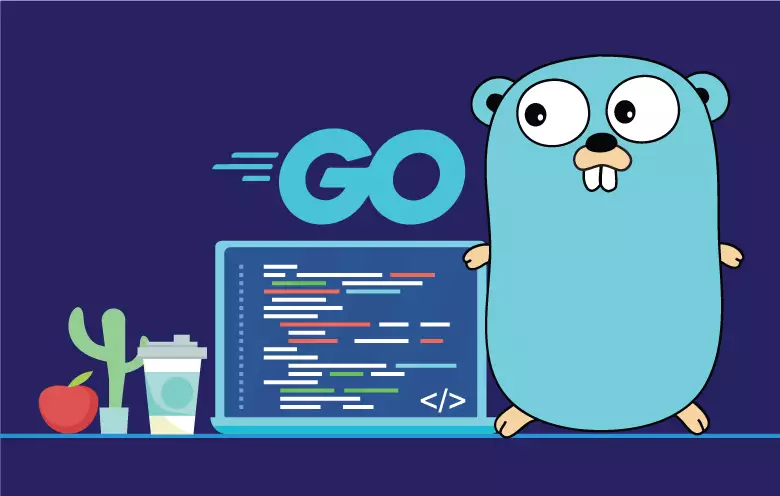

# Go Programming Language

This repository contains all the practice questions I did during my learning phase

## Important Links 
- https://roadmap.sh/golang
- https://go.dev/doc/
- https://gobyexample.com/
- https://quii.gitbook.io/learn-go-with-tests
- https://www.oreilly.com/library/view/introducing-go/9781491941997/